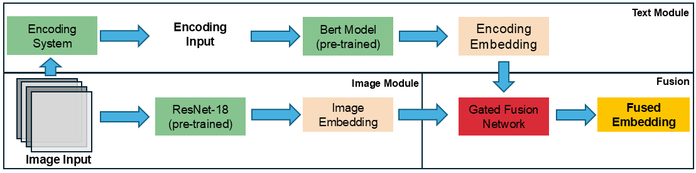

## Vision-Language Model for Hardware Assurance
This the original code for using VLM for hardware assurance purpose. The figure below is the model architecture.

### Python dependencies
The required python dependencies can be found at `docs/requirements.txt`, all required dependencies can be installed via the requirement file.

### Code Execution
#### Pre-training Language Model
Use command `python main_BERT.py` to start training model: the default dataset is Nangate-45nm.

To customize the parameters, provide them as command line arguments, for example:
`python /blue/woodard/zhum/vlm/main_BERT.py      --library 'SAED' --node_technology 32 --num_classes 286 --batch_size 32 --lr 1e-5 --max_length 105 --vocab_size 245 --max_width 1950`

**Note**: `num_classes`, `max_length`, `max_width`, and `vocab_size` vary as the node technology changes. 

#### Pre-training Image Model
Use command `python main_CNN.py` to start training model: the default dataset is Nangate-45nm.

To customize the parameters, provide them as command line arguments, for example:
`python /blue/woodard/zhum/vlm/main_CNN.py   --library 'SAED' --node_technology 32 --num_classes 286 --batch_size 32 --num_channels 4 --lr 1e-5 --max_length 105 --vocab_size 245 --max_width 1950`

**Note**: `num_classes`, `max_length`, `max_width`, and `vocab_size` vary as the node technology changes. 

#### Training VLM
Use command `python main.py --BERT_weight 'BERTClassifier_trained_202510292026.pt' --CNN_weight 'ResNet18_trained_4channel_202510291409.pt'` to start training model: the default dataset is Nangate-45nm.

To customize the parameters, provide them as command line arguments, for example:
`python /blue/woodard/zhum/vlm/main.py 	--library 'SAED' --node_technology 32 --num_classes 286 --batch_size 32 --lr 1e-5 --es_delta 0.001 --margin 0.6 --scale 64 --max_length 105 --vocab_size 245 --max_width 1950 --BERT_weight 'BERTClassifier_trained_202510300545.pt' --CNN_weight 'ResNet18_trained_4channel_202511050312.pt'`

**Note**: `num_classes`, `max_length`, `max_width`, and `vocab_size` vary as the node technology changes. 

#### Testing VLM
Simply add `--test_mode` to the command for training the model, and the testing process would start accordingly.
